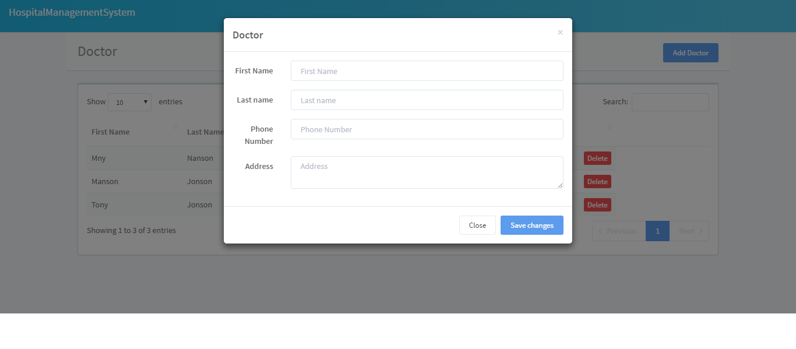

# Hospital Management System

Hospital management project ENG EC 530.

## Screenshots

Here are some screenshots of the application:





## Getting Started

To run the application, use the following command:

```sh
python app.py
```

This will start the Flask server on your local machine.

### Docker

We use Docker to containerize our application. This allows us to create a self-contained environment that can run anywhere Docker is installed.

First, make sure you have Docker installed on your machine.

Here's how you can build and run the Docker image:

```sh
# Build the Docker image
docker build -t hms .

# This will create a Docker image named "hms" based on the instructions
# in the Dockerfile in your current directory.

# Run the Docker image
docker run -p 4000:80 hms

# This will start a Docker container.
# The -p 4000:80 option tells Docker to forward the exposed port 80 on the container
# to port 4000 on your machine.
```

### Continuous Integration

We use GitHub Actions for continuous integration. This allows us to automatically build and test our application every time we push to the repository.

Our GitHub Actions workflow is defined in the `.github/workflows/main.yml` file in the repository. Here's what it looks like:

```yaml
name: Python application test

on:
  push:
    branches: [ master ]
  pull_request:
    branches: [ master ]

jobs:
  build:

    runs-on: ubuntu-latest

    steps:
    - uses: actions/checkout@v2
    - name: Set up Python 3.8
      uses: actions/setup-python@v2
      with:
        python-version: 3.8
    - name: Install dependencies
      run: |
        python -m pip install --upgrade pip
        pip install flask flask_restful
        if [ -f requirements.txt ]; then pip install -r requirements.txt; fi
    - name: Run tests
      run: |
        python -m unittest discover
```

This workflow is triggered every time code is pushed to the master branch or a pull request is made against the master branch. It sets up a Python 3.8 environment, installs the necessary dependencies, and runs the unit tests.

### Configure

The application's configuration is stored in a JSON file. Here's what it looks like:

```json
{
  "database": "database.db",
  "port": 5000,
  "host": "127.0.0.1"
}
```

## Contributing

We welcome contributions to this project. Here's how you can contribute:

1. Open an issue to discuss your proposed changes.
2. Fork the repository and make your changes.
3. Open a pull request and describe your changes.

By contributing to this repository, you agree to make your content available under the same license as the original project.

## License

This project is licensed under the MIT License. You are free to use, modify, and distribute the code, but you must include the original copyright notice and disclaimers.
```